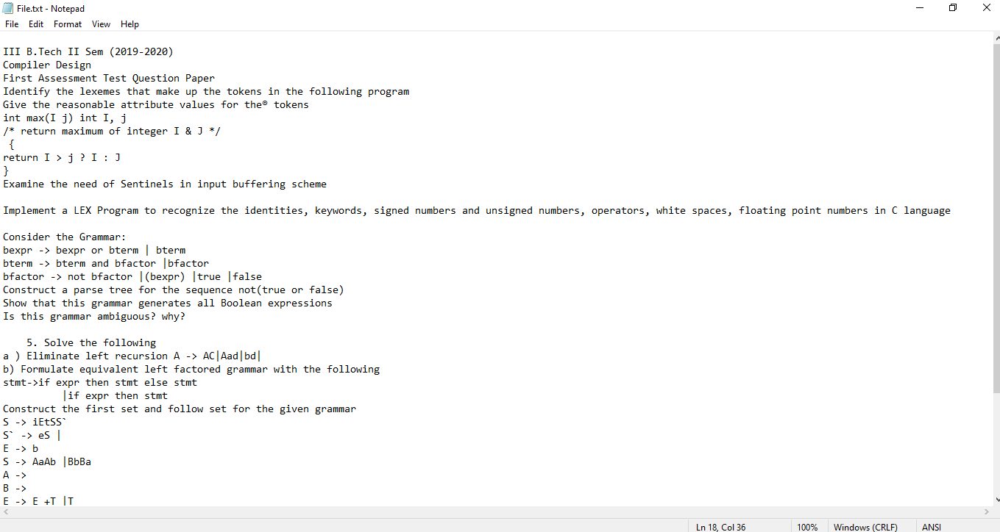
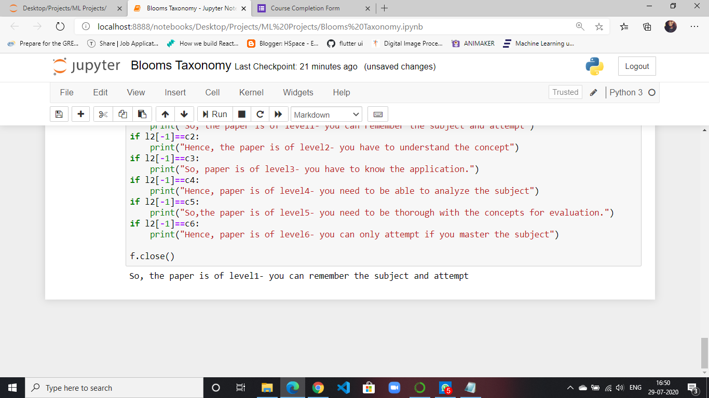

# BloomsTaxonomy
ML algorithm for paper assessment using Blooms Taxonomy. This can be used to assess any subjective question paper. If you give the file as the input , the model will give you the level of the paper.

So for example:

If you give a question paper as follows:

You get:

